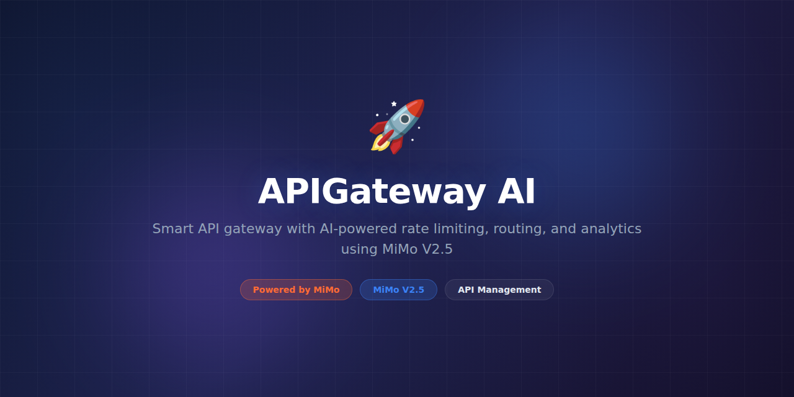

# APIGateway AI



> **Powered by MiMo** — built on top of Xiaomi's [MiMo](https://platform.xiaomimimo.com) reasoning models for intelligent API routing and traffic management.

[](https://opensource.org/licenses/MIT)
[](https://platform.xiaomimimo.com)
[](https://go.dev/)

---

## Why MiMo

API gateways traditionally use static routing rules — if path matches `/users`, forward to service A. This works for simple architectures but breaks down when routing decisions require understanding request intent, payload semantics, or dynamic service health. As microservice architectures grow to dozens or hundreds of services, routing complexity explodes and static rules become unmaintainable.

MiMo V2.5 adds a reasoning layer to API routing that static rules cannot replicate. It can understand the *intent* behind an API request by analyzing its payload and context, route based on semantic meaning rather than just path matching, and make intelligent decisions about load balancing, failover, and request transformation. This is especially valuable for AI-serving APIs where requests vary dramatically in complexity and resource requirements — a simple classification request shouldn't be routed to the same model as a complex reasoning task.

The model also powers intelligent rate limiting, anomaly detection, and request enrichment — capabilities that require understanding *what* a request is doing, not just *where* it's going. Traditional gateways treat all requests to the same endpoint identically; APIGateway AI treats each request individually based on its characteristics.

## Token consumption

| Agent | Model | Tokens/run | Frequency | Daily/user |
|---|---|---|---|---|
| Route Planner | MiMo V2.5 | ~1,200 | Per complex request | ~120,000 |
| Anomaly Detector | MiMo V2.5 | ~2,000 | Per batch (100 reqs) | ~28,800 |
| Request Enricher | MiMo V2.5 | ~800 | Per enrichment | ~16,000 |
| **Total** | | **~4,000** | | **~164,800** |

> Simple requests (path-based routing, health checks) bypass MiMo entirely, keeping token costs low for standard traffic.

## What it does

APIGateway AI is an intelligent API gateway that uses MiMo to understand request semantics, route traffic based on intent and payload complexity, detect anomalies, enrich requests with context, and optimize load distribution across AI model endpoints and microservices. It combines a high-performance Go proxy with a Python AI engine.

## Why this exists

Organizations running multiple AI models behind an API gateway face routing challenges that static rules can't solve. Different models have different costs, latencies, and capabilities. Requests vary in complexity. APIGateway AI intelligently matches each request to the optimal backend, reducing costs by routing simple requests to cheaper models while directing complex queries to capable ones like MiMo.

## Features

- Semantic request routing based on intent classification
- AI-model-aware load balancing with cost optimization
- MiMo-powered anomaly detection on traffic patterns
- Request enrichment with context injection headers
- Dynamic rate limiting based on request complexity and cost
- Circuit breaker with intelligent failover and retry policies
- Real-time dashboard with routing analytics and cost tracking
- Plugin architecture for custom middleware
- Request/response transformation and validation
- Multi-region support with latency-based routing

## Tech Stack

- **Gateway:** Go 1.22+ (high-performance HTTP proxy)
- **AI Engine:** MiMo V2.5 via Xiaomi Platform API (Python 3.11+)
- **Proxy:** custom Go HTTP proxy with async AI routing
- **Storage:** Redis (rate limiting, cache), Prometheus (metrics)
- **Dashboard:** React with Recharts visualization
- **Config:** YAML with file-watch hot-reload
- **Infra:** Docker, Kubernetes, Helm charts

## Quickstart

```bash
# Clone and install
git clone https://github.com/your-org/APIGateway-AI.git
cd APIGateway-AI

# Build the Go gateway
cd gateway && go build -o apigw && cd ..

# Install the Python AI engine
pip install -e ".[dev]"

# Configure
cp config.example.yaml config.yaml
# Set MIMO_API_KEY and backend service URLs in config.yaml

# Start the AI routing engine (background)
python -m engine serve &

# Start the gateway proxy
./gateway/apigw --config config.yaml

# Test intelligent routing
curl -X POST http://localhost:8080/v1/chat \
  -H "Content-Type: application/json" \
  -d '{"message": "Summarize this document", "context": "long document text..."}'
# → routed to optimal model based on intent analysis

# Test with simple query (routed to fast model)
curl -X POST http://localhost:8080/v1/chat \
  -H "Content-Type: application/json" \
  -d '{"message": "Hello, what time is it?"}'

# Run via Docker Compose
docker compose up -d
```

## Project Structure

```
APIGateway-AI/
├── assets/
│   └── banner.png
├── gateway/                    # Go-based high-performance proxy
│   ├── main.go                 # Entry point
│   ├── proxy.go                # Core HTTP proxy handler
│   ├── middleware.go           # Request/response middleware chain
│   ├── circuit.go              # Circuit breaker implementation
│   └── config.go               # YAML configuration loader
├── engine/                     # Python AI routing engine
│   ├── __init__.py
│   ├── router.py               # MiMo semantic routing engine
│   ├── anomaly.py              # Traffic anomaly detection
│   ├── enricher.py             # Request enrichment & context injection
│   ├── balancer.py             # AI-model-aware load balancer
│   ├── cost.py                 # Cost optimization calculator
│   └── server.py               # Internal API for gateway communication
├── dashboard/                  # React monitoring UI
│   ├── src/
│   └── package.json
├── tests/
│   ├── test_router.py
│   ├── test_anomaly.py
│   └── gateway_test.go
├── config.example.yaml
├── docker-compose.yml
├── Dockerfile
├── pyproject.toml
└── README.md
```

## Contributing

See [CONTRIBUTING.md](CONTRIBUTING.md) for guidelines. We welcome new routing strategies, anomaly detection algorithms, and dashboard improvements.

## Configuration

Define backends and routing rules:

```yaml
# config.yaml
gateway:
  port: 8080
  read_timeout: 30s
  max_request_size: 10MB

backends:
  - name: "mimo-reasoning"
    url: "http://mimo-cluster:8000"
    cost_per_1k: 0.015
    max_concurrent: 100
  - name: "fast-model"
    url: "http://fast-cluster:8000"
    cost_per_1k: 0.001
    max_concurrent: 500

routing:
  complexity_threshold: 0.6
  enable_semantic_routing: true
  anomaly_detection: true
  rate_limit:
    requests_per_minute: 1000
    burst: 50
```

## License

MIT License — see [LICENSE](LICENSE) for details.

---

*Built with ❤️ using MiMo reasoning models.*
